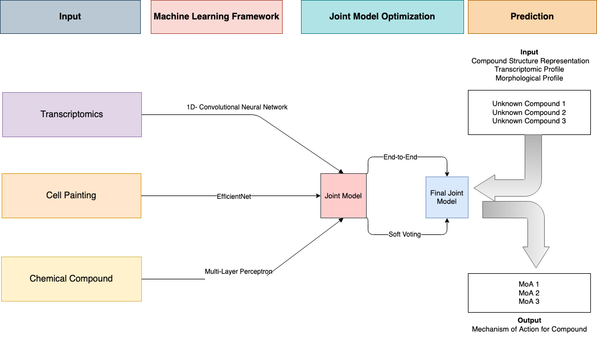
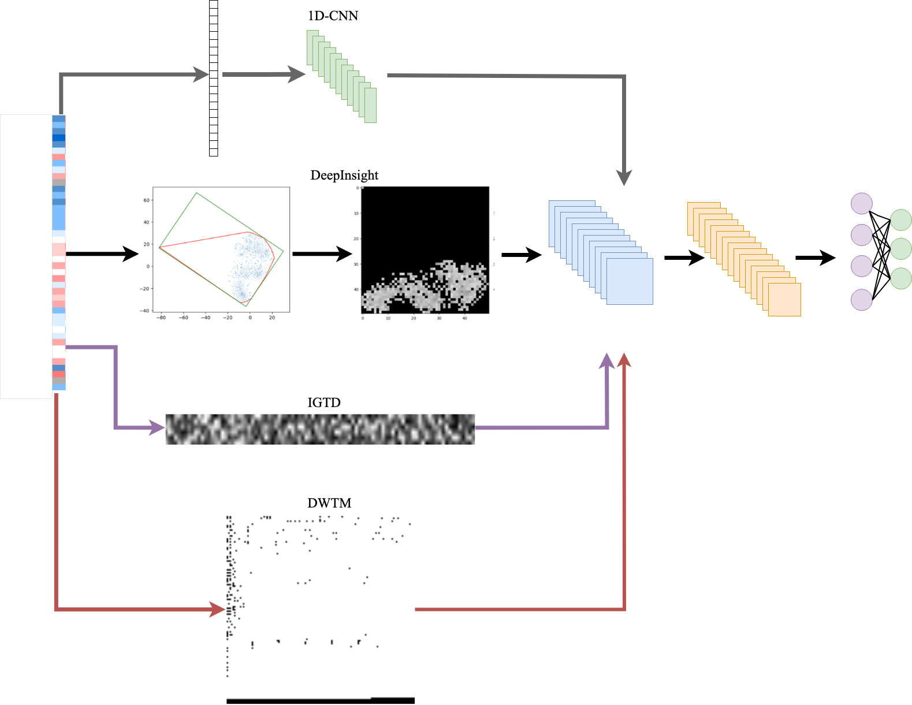

# README File
## Erik Everett Palm's 45 HP MSc Thesis
### Supervisors: Ola Spjuth, Phillip Harrison
### Subject Reader: Carolina Wählby
### Abstract
The rapid progress in high-throughput omics methods and high-resolution morphological profiling, coupled with the significant advances in machine learning (ML) and deep learning (DL), has opened new avenues for tackling the notoriously difficult problem of predicting the Mechanism of Action (MoA) for a drug of clinical interest. Understanding a drug's MoA can enrich our knowledge of its biological activity, shed light on potential side effects, and serve as a predictor of clinical success.

This project aimed to examine whether incorporating gene expression data from LINCS L1000 public repository into a joint model previously developed by Tian et al. (2022), which combined chemical structure and morphological profiles derived from Cell Painting, would have a synergistic effect on the model's ability to classify chemical compounds into ten well-represented MoA classes. To do this, I explored the gene expression dataset to assess its quality, volume, and limitations. I applied a variety of ML and DL methods to identify the optimal single model for MoA classification using gene expression data, with a particular emphasis on transforming tabular data into image data to harness the power of convolutional neural networks. To capitalize on the complementary information stored in different modalities, I tested end-to-end integration and soft-voting on sets of joint models across five stratified data splits.

The gene expression dataset was relatively low in quality, with many uncontrollable factors that complicated MoA prediction. The highest-performing gene expression model was a one-dimensional convolutional neural network, with an average macro F1 score of 40.877 and a standard deviation of 0.034. Approaches converting tabular data into image data did not significantly outperform other methods. Combining optimized single models resulted in a performance decline compared to the best single model in the combination. To take full advantage of algorithmic developments in drug development and high-throughput multi-omics data, my project underscores the need for standardizing data generation and optimizing data fusion methods.

## Visual Summary of the project

## Tabular-to-Image Algorithm Flowchart
